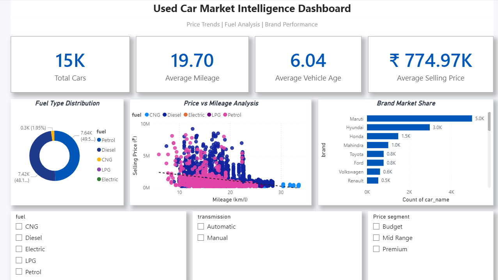
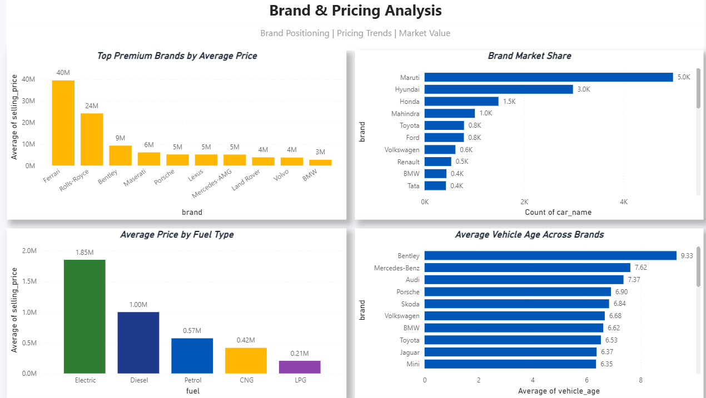
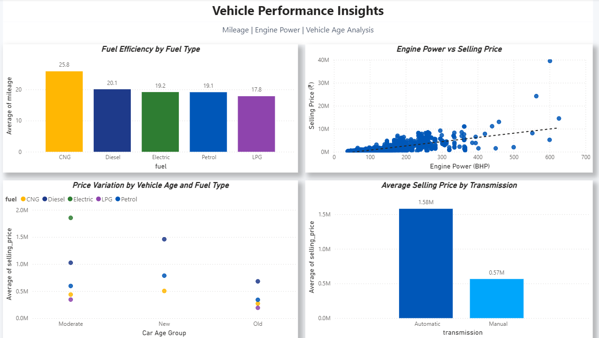
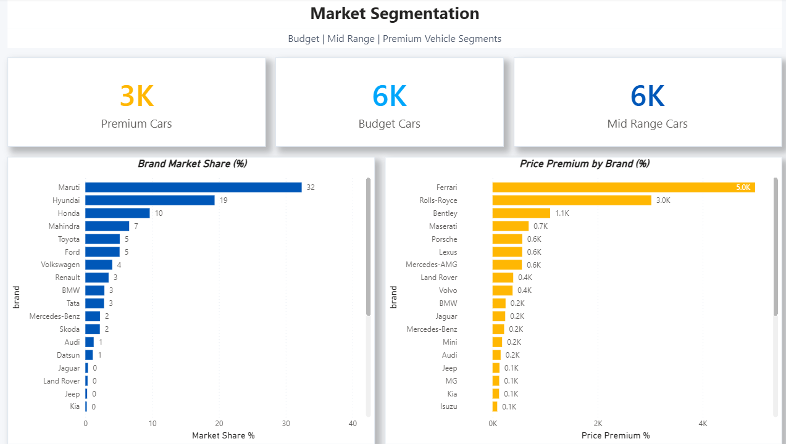
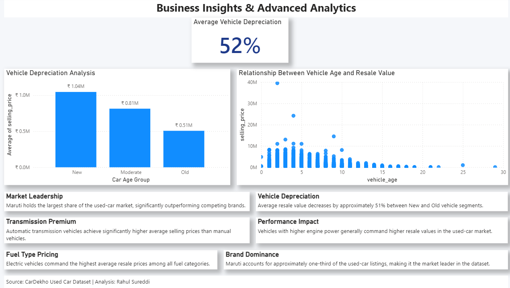

# Used Car Market Analysis Dashboard

## Project Resources

📷 Dashboard Images: [Open Images Folder](./images)

📝 SQL Queries: [Open SQL Folder](./sql)

## Project Overview

This project analyzes used car market data to understand pricing trends, vehicle characteristics, and customer preferences. The analysis helps identify factors that influence vehicle prices and market demand.

## Business Problem

Used car buyers and sellers need to understand:

* Which brands command higher prices
* Impact of vehicle age on price
* Fuel type preferences
* Transmission trends
* Market demand patterns

This project uses SQL and Power BI to uncover these insights.

## Tools Used

* SQL
* Power BI
* Excel

## Dataset

The dataset contains:

* Car Brand
* Model
* Selling Price
* Fuel Type
* Transmission
* Year of Manufacture
* Ownership Information

## Project Workflow

1. Data Cleaning
2. Exploratory Data Analysis
3. KPI Calculation
4. SQL Analysis
5. Dashboard Development
6. Business Insights

## Dashboard Screenshots

📂 Dashboard Images: [Open Images Folder](./images)

### Dashboard Overview

### Brand & Pricing Analysis

### Vehicle Performance Insights

### Market Segmentation Analysis

### Business Insights & Advanced Analytics

## SQL Analysis

The project uses SQL for:

* Data Cleaning
* Price Analysis
* Brand Performance Analysis
* Fuel Type Analysis
* Vehicle Age Analysis
* Market Trend Analysis

SQL scripts are available in the `/sql` folder.

## Key Insights

(To be added after dashboard completion)

## Business Impact

This analysis helps:

* Buyers make informed purchasing decisions
* Sellers understand pricing strategies
* Dealerships identify market trends
* Businesses improve inventory planning

## Skills Demonstrated

* SQL Query Writing
* Data Cleaning
* Data Visualization
* Power BI Dashboarding
* Business Intelligence
* Automotive Data Analysis
